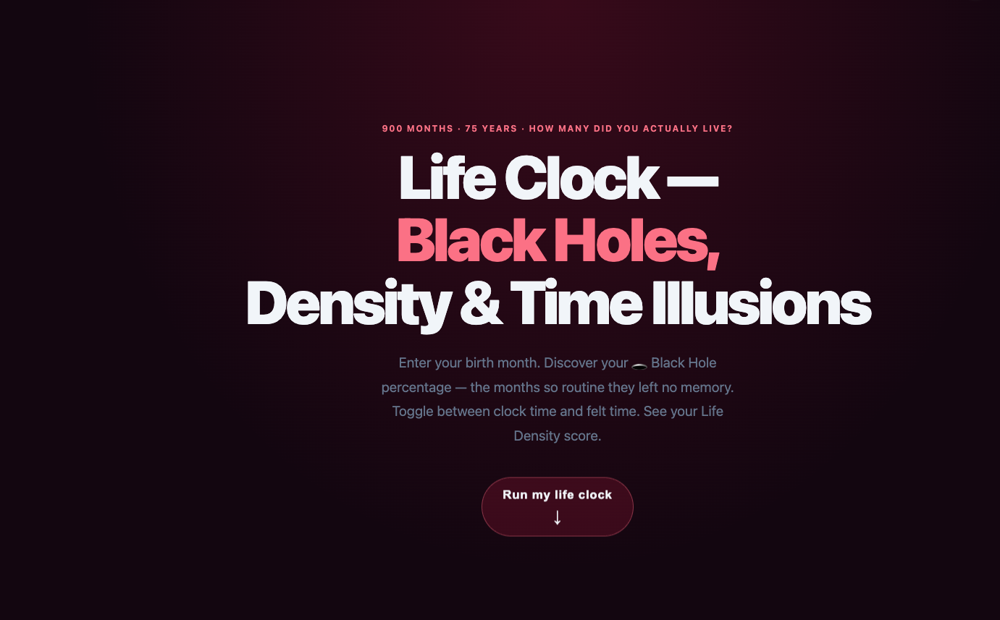
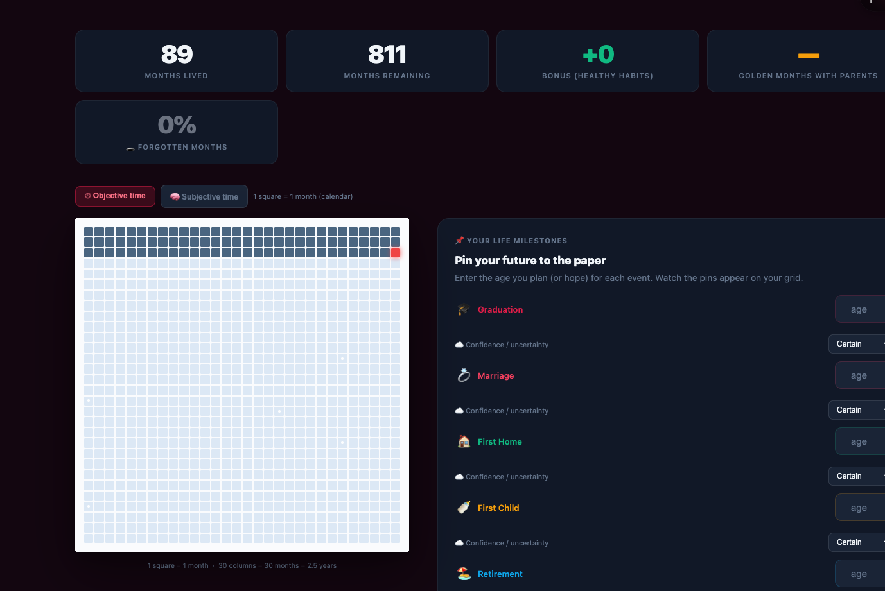

# Life Clock — Black Hole Months, Felt Time & Life Density Calculator (Free Browser Tool)

**[🔴 Live Demo → ordinarymantrying.com/tools/life-clock/](https://ordinarymantrying.com/tools/life-clock/)**  
**[▶ Open on GitHub Pages →](https://daligao.github.io/life-clock/)**

A free life analytics tool that goes beyond calendar time. Enter your birth month. Discover what percentage of your life has been a 🕳️ **Black Hole** — months so routine they left no memory — and get your **Life Density score**.

**No sign-up. No install. Works in any browser.**

---

## The Question Most Life Tools Don't Ask

Most "your life in weeks" tools show you *clock time* — how many weeks have passed, how many remain.

This tool asks something harder: **how many of those months did you actually live?**

> "The first 18 years felt like forever. The last 10 years disappeared. Same number of months — completely different felt length."

That gap between clock time and felt time is what this tool measures.

---

## Features

**🕳️ Black Hole Calculator**  
What % of your life has been forgotten months — stretches so routine, so repetitive, that they left no distinct memory? Enter your pattern, get your Black Hole percentage.

**🧠 Clock Time vs Felt Time Toggle**  
Switch between objective time (1 square = 1 month) and subjective felt time. Childhood looks longer because every month was genuinely new. The grid reshapes to show this mathematically.

**📊 Life Density Index**  
A 0–100 score for how "lived" your life has been — calculated from milestone density, memory distinctiveness, and novel-experience ratio.

**💛 Golden Months with Parents**  
Enter your parents' current ages. See exactly how many months of meaningful overlap you likely have left — the number most people have never calculated.

**📌 Future Milestones with Confidence Ranges**  
Pin upcoming events (graduation, career change, retirement) with a certainty slider. They appear on your grid as probability clouds, not fixed points.

---

## How It Differs From Similar Tools

| Tool | Focus |
|---|---|
| Tim Urban's "Your Life in Weeks" | Calendar time, static image |
| [life-paper](https://github.com/daligao/life-paper) | Famous lives archive — no personal data, 7 lenses |
| [life-a4](https://ordinarymantrying.com/tools/life-a4/) | Personal grid — wishes, longevity habits |
| **life-clock (this tool)** | Personal analytics — black holes, felt time, Life Density score |

---

## Technical

- Single HTML file — no dependencies, no build step
- Subjective time mode: variable row heights calculated in JS
- Life Density Index: composite score from milestone + memory data
- `localStorage` for all session state

---

## Part of the Life Trilogy

All three tools share the same 900-square grid metaphor — different angles on the same question.

→ [life-paper](https://ordinarymantrying.com/tools/life-paper/) · [life-a4](https://ordinarymantrying.com/tools/life-a4/) · [life-clock](https://ordinarymantrying.com/tools/life-clock/)

*Built as part of [Ordinary Man Trying](https://ordinarymantrying.com/) — a public experiment in building a blog and tool suite using AI, with zero prior tech background.*

---

## Transparency

Built by a non-technical Chinese parent using AI as a development partner — zero coding background. The questions this tool asks (what % of your life is a black hole? how many golden months with your parents?), the Life Density concept, the felt-time toggle — all human ideas. The AI wrote the code.

The companion blog post was drafted by AI based on my notes, and is [labeled as such](https://ordinarymantrying.com/life-density-score-black-hole-months-felt-time/).

**Content labeling policy:** Blog posts where AI wrote the text for SEO purposes carry "(AI Generated)" in the title. Posts where the human author prepared the content and ideas do not carry that label. Featured images are optional for SEO posts. Building in public means being honest about the process. This is the process.
